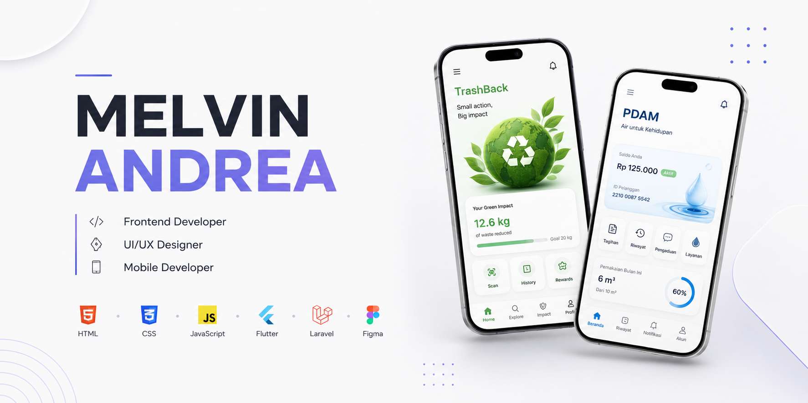
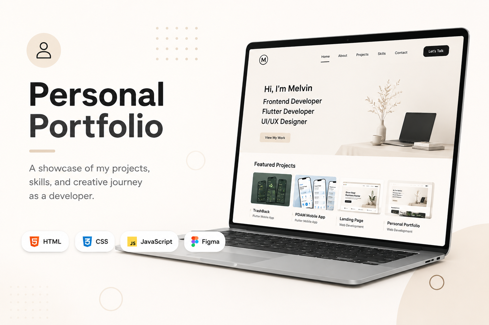
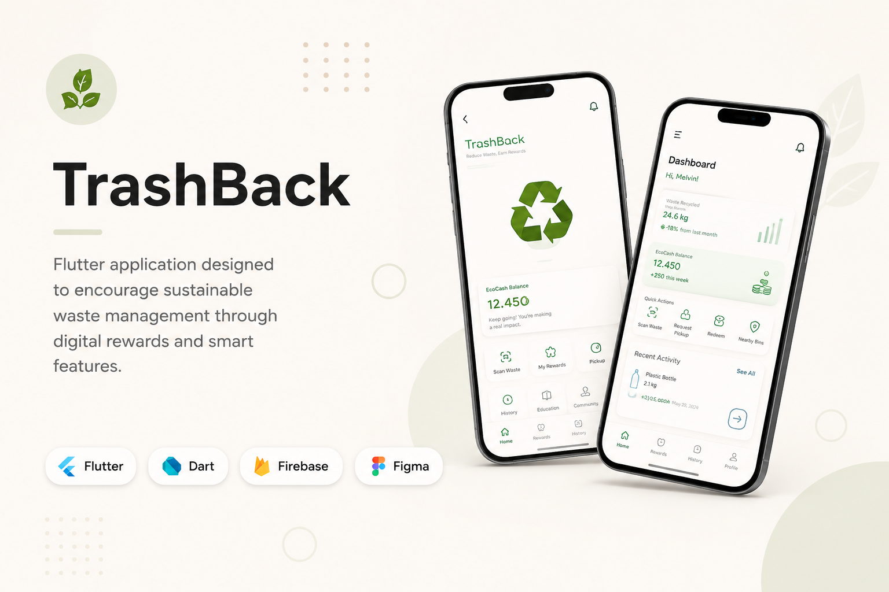
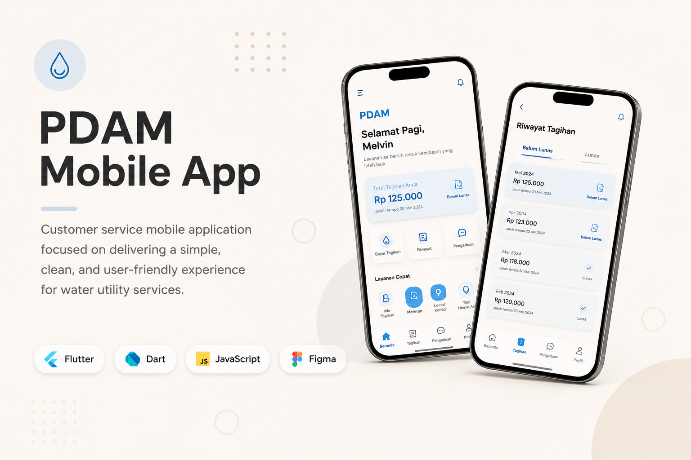
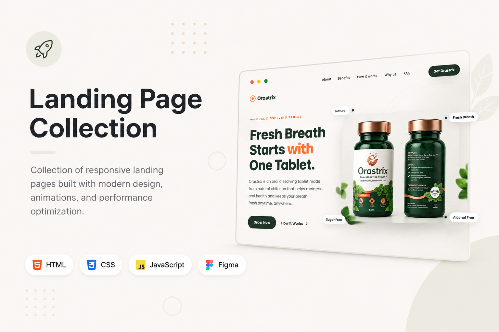

# Hi, I'm Melvin 👋

### Frontend Developer • Flutter Developer • UI/UX Designer

I enjoy building modern websites and mobile applications by combining frontend development, Flutter, and user-centered design into meaningful digital experiences.

---

# 🚀 About Me

I'm a Software Engineering student from Indonesia with a strong interest in Frontend Development, Flutter Development, and UI/UX Design.

I enjoy transforming ideas into real digital products—from designing interfaces in Figma to developing responsive websites and cross-platform mobile applications.

Besides software development, I also explore photography, filmmaking, videography, and visual storytelling. These creative experiences help me design products that are not only functional, but also engaging and enjoyable to use.

---

# 💼 Featured Projects

## 🌐 Personal Portfolio

  

A modern portfolio website showcasing my software development journey, featured projects, certifications, and creative works.

**🌍 Live Website**
> https://project-portofolio-ten-rosy.vercel.app/

**📂 Repository**
> https://github.com/MelvinnS/PROJECT---Portofolio

---

## ♻️ TrashBack

  

A Flutter-based mobile application designed to encourage sustainable waste management through a digital reward system with a modern and intuitive user experience.

**📂 Repository**
> https://github.com/MelvinnS/PROJECT---Trashback

---

## 💧 PDAM Mobile App

    

A customer service mobile application focused on delivering a simple, clean, and user-friendly experience for water utility services.

**📂 Repository**
> https://github.com/MelvinnS/PROJECT-PDAM

---

## 🚀 Landing Page Collection

  

A collection of responsive landing pages built with HTML, CSS, and JavaScript, focusing on performance, animations, and modern UI implementation.

**📂 Repository**
> https://github.com/MelvinnS/PROJECT---Landing-Page-Orastrix

---

# 📊 GitHub Statistics

# 🐍 Contribution Snake

# 🏆 GitHub Trophy

---

# 💻 Tech Stack

### Languages

- HTML
- CSS
- JavaScript
- Dart

### Frameworks

- Flutter

### UI / UX

- Figma
- Wireframing
- Prototyping
- User Interface Design
- User Experience Design

### Tools

- Git
- GitHub
- Visual Studio Code
- Android Studio

---

# 🎬 Creative Side

Beyond software development, I also enjoy creating visual stories through:

- 📸 Photography
- 🎥 Videography
- 🎬 Film Production
- ✂️ Video Editing
- 🎨 Graphic Design

I believe creativity and technology complement each other in building products that are functional, visually engaging, and enjoyable for users.

---

# 📚 Currently Learning

I'm currently focusing on improving my skills in:

- Flutter Development
- Frontend Development
- UI/UX Design
- Responsive Web Development
- Software Engineering Best Practices

---

# 🎯 2026 Goals

- Build more real-world Flutter applications
- Create modern frontend projects with better UI/UX
- Expand my software development portfolio
- Continue learning User Experience Design
- Contribute to more open-source and collaborative projects

---

# 📫 Let's Connect

🌐 Portfolio

https://project-portofolio-ten-rosy.vercel.app/

💼 LinkedIn

https://www.linkedin.com/in/melvinandrea/

📧 Email

mailto:fallskie25@gmail.com

---

> *"I enjoy turning ideas into digital products that are simple, functional, and enjoyable to use."*
